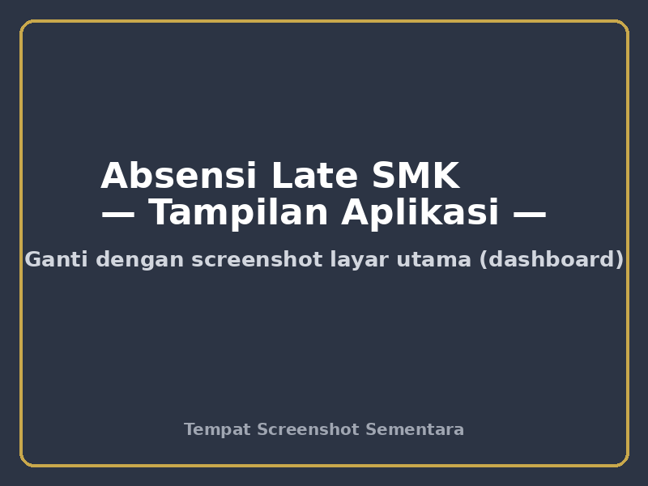
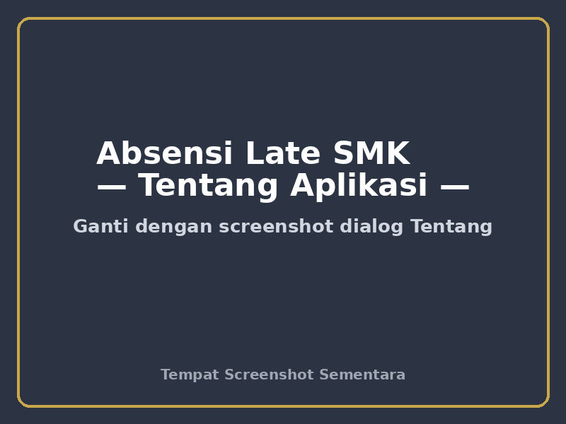
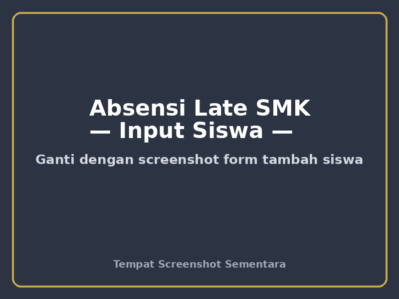

# 📱 Absensi Late — SMK Negeri 1 Maluku Tengah

Aplikasi **Android offline-first** untuk pencatatan absensi keterlambatan siswa dan manajemen pelanggaran di lingkungan **SMK Negeri 1 Maluku Tengah**. Dibangun dengan **Kotlin + Jetpack Compose + Room**, dirancang agar mudah dipakai guru piket dan pembina OSIS di lapangan, tanpa perlu koneksi internet yang stabil — semua data tersimpan **lokal di perangkat** dan dapat dibagikan antar perangkat via **QR handshake**, atau dikirim ke **Telegram** sebagai laporan cadangan.

---

## 📸 Tampilan Aplikasi

> Gambar di bawah ini masih **placeholder** — silakan ganti dengan screenshot asli aplikasi.

| Tampilan Utama | Tentang Aplikasi | Form Input Siswa |
|---|---|---|
|  |  |  |

---

## ✨ Fitur Utama

- **Pencatatan keterlambatan & pelanggaran** satu ketukan — tekan tombol `+1` pada kartu siswa, waktu terekam otomatis.
- **Tidak butuh internet**: seluruh data tinggal di perangkat (SQLite lewat Room), offline-first.
- **QR Handshake Sync**: bagikan data antar perangkat lewat hotspot lokal (`LocalOnlyHotspot` + server `NanoHTTPD`) — QR berisi gabungan **WiFi + URL**.
- **Kirim ke Server (Telegram)**: kirim **2 file sekaligus** — data terkompresi `.json.gz` + cadangan `.csv` (siap dibuka di Excel). Pesan info otomatis menampilkan nama & ukuran kedua file.
- **Kelola Data**: *Backup Nama Siswa* (roster), *Restore* (ganti total), *Hapus Semua Siswa* (konfirmasi ketik `HAPUS`), atur *Max Pelanggaran*.
- **Rekap pelanggaran**: layar rekap dengan multi-select, ekspor **CSV / PDF** via MediaStore.
- **Dark mode** + tema *Navy & Gold*, ikon WhatsApp **transparan** tanpa kotak putih.

---

## 📑 Daftar Isi

1. [Deskripsi Aplikasi](#1-deskripsi-aplikasi)
2. [Fitur Lengkap](#2-fitur-lengkap)
3. [Teknologi](#3-teknologi)
4. [Struktur Proyek](#4-struktur-proyek)
5. [Persyaratan Build](#5-persyaratan-build)
6. [Cara Build APK](#6-cara-build-apk)
7. [Cara Install](#7-cara-install)
8. [Konfigurasi Secret (local.properties)](#8-konfigurasi-secret-localfolder-properties)
9. [Cara Pakai](#9-cara-pakai)
10. [FAQ](#10-faq)
11. [Kontribusi & Lisensi](#11-kontribusi--lisensi)
12. [Disclaimer Data](#12-disclaimer-data)

---

## 1. Deskripsi Aplikasi

**Absensi Late** adalah aplikasi Android buatan internal sekolah yang dipakai untuk:

1. Mencatat siswa yang datang **terlambat** setiap hari.
2. Menghitung akumulasi pelanggaran per siswa dalam satu pekan.
3. Memberi **peringatan otomatis** ketika jumlah pelanggaran melewati ambang maksimal (`maxViolation`, bawaan **3**).
4. Menghubungkan petugas ke **WhatsApp orang tua/wali** untuk konfirmasi langsung.
5. Membuat **rekapan** yang bisa diekspor ke **CSV** (untuk Excel) dan **PDF**.
6. Mengirim laporan cadangan ke **grup Telegram sekolah** secara aman dan cepat.
7. **Sinkronisasi antar perangkat** piket lewat teknologi QR handshake (tanpa internet/kabel).

Aplikasi memakai arsitektur **single-Activity + Jetpack Compose**, satu `MainViewModel` sebagai pusat logika bisnis, **Room Database** dengan migrasi versi & **TypeConverter** yang toleran terhadap perubahan skema antar versi. Tidak ada data yang dikirim ke luar kecuali saat fitur *Kirim Ke Server* dijalankan secara manual.

**Versi saat ini:** `1.1` (versionCode `2`).

---

## 2. Fitur Lengkap

### 2.1 Manajemen Siswa
- Tambah siswa individu (form input nama, kelas, jurusan, No. HP siswa, No. HP orang tua/wali).
- Edit & **hapus siswa** (dengan konfirmasi agar tidak terhapus tanpa sengaja).
- Pencarian instan (nama), **filter kelas & jurusan**, *sorting* (terbaru/abjad).
- Kartu siswa berwarna **dinamis** sesuai `violationCount` vs `maxViolation` (hijau → kuning → merah).

### 2.2 Pencatatan Pelanggaran
- **`+1`** = tambah satu pelanggaran & catat timestamp otomatis.
- **Decrement**, **reset**, dan **hapus timestamp tertentu** pada detail siswa.
- **Multi-select batch**: pilih banyak siswa sekaligus untuk rekap atau menambah pelanggaran via satu query batch.

### 2.3 QR Synchronization (Penting untuk Multi Perangkat)
- *Export QR*: perangkat menjadi hotspot lokal (`LocalOnlyHotspot`) + menyajikan data via `NanoHTTPD`.
- *Scan QR*: perangkat lain memindai QR yang berisi **SSID + password + URL** lalu otomatis terhubung ke hotspot dan mengunduh data.
- *Scan dari galeri*: didukung ML Kit Barcode Scanning.
- Data digabung dengan logika **merge berbasis UUID unik** per siswa — tidak ada duplikat, saling melengkapi.

### 2.4 Kelola Data (Roster)
- **Backup Nama Siswa**: simpan roster (nama + kelas + HP) ke file CSV terpisah.
- **Restore Nama Siswa**: ganti total seluruh daftar siswa dari file backup (header divalidasi).
- **Hapus Semua Siswa**: wipe + reset konfigurasi (termasuk maxViolation), wajib mengetik **`HAPUS`**.
- **Import CSV (tambah/append)**: data siswa lama **tidak diubah**, siswa baru ditambahkan.
- **Import `.json.gz`**: memakai parser aman `JsonArray` — kebal terhadap error *TypeToken* pada build release yang di-minify (R8).

### 2.5 Rekap & Laporan
- Layar **Rekap Pelanggaran** dengan rentang waktu.
- Ekspor **CSV** (RFC 4180 — menangani koma & tanda kutip) dan **PDF** melalui API **MediaStore**.
- Normalisasi nomor HP Indonesia ke format **62xxx** otomatis (`PhoneNumberUtil`).

### 2.6 Kirim Ke Server (Telegram)
- Sekali tekan: kirim pesan info + **`students_<timestamp>.json.gz`** + **`students_<timestamp>.csv`** ke grup/chat yang dikonfigurasi.
- Menampilkan nama & ukuran kedua file sebagai bukti pengiriman.
- Token & chat ID diambil dari `BuildConfig` (bukan hardcode di kode).

### 2.7 Tampilan & Pengalaman
- Tema **Navy & Gold**; **dark mode** lewat `ThemeManager` + Material3 color scheme.
- Splash screen dengan logo sekolah + animasi tiga titik.
- Ikon kontak (WhatsApp / Instagram / TikTok) **transparan**, menyatu dengan tema terang & gelap.
- *Haptic feedback*, *debounce* pencarian, `contentType` untuk performa daftar siswa besar.

### 2.8 Keamanan & Pemeliharaan
- Seluruh akses database dibungkus `try-catch` + log (`MainViewModel`, `AppDatabase`, `CRASH:`).
- **UUID unik per siswa** untuk sinkronisasi; migrasi Room berjenjang (v1→v4).
- Network binding dilepas di `finally` setelah sinkronisasi.

---

## 3. Teknologi

| Lapisan | Teknologi |
|---|---|
| Bahasa | Kotlin 1.9.20 |
| UI | Jetpack Compose (BOM 2024.02.00), Material 3 |
| Persistensi | Room 2.6.1 + KSP, migrations, TypeConverter |
| Serialisasi | Gson (import aman via `JsonArray`), CompactSerializer (QR v2) |
| Jaringan | NanoHTTPD, OkHttp, `LocalOnlyHotspot`, `bindProcessToNetwork` |
| Scanner | ML Kit Barcode Scanning |
| Build | Gradle 8.2, AGP 8.2.0, R8 (minify di release), proguard-rules |
| Target | minSdk 29 (Android 10), targetSdk 34 |

---

## 4. Struktur Proyek

```
app/src/main/java/com/osis/smkn1malteng/absensilate/
├── data/
│   ├── local/          # Room: Entity, DAO, database & migrasi, TypeConverter
│   └── model/          # Enum kelas & jurusan (StudentClass, StudentMajor)
├── network/            # TelegramSender, SyncClient, SyncServerManager
├── sync/               # QR sync, CompactSerializer, CsvEngine, RosterBackup
├── ui/
│   ├── screens/        # Dashboard, InputForm, Recap, Splash
│   ├── theme/          # Warna, tema, ThemeManager
│   └── viewmodel/      # MainViewModel (pusat logika)
└── util/               # PhoneNumberUtil, RecapExporter
```

---

## 5. Persyaratan Build

- **JDK 17** (disarankan; AGP 8.2 kompatibel dengan JDK 17).
- **Android SDK** (platform 34, build-tools).
- **Android Studio** (opsional — build bisa via CLI `./gradlew`).
- Koneksi internet saat *pertama* kali untuk mengunduh dependency (build berikutnya bisa `--offline`).

---

## 6. Cara Build APK

**Debug:**
```bash
./gradlew clean assembleDebug --no-daemon
# Output: app/build/outputs/apk/debug/app-debug.apk
```

**Release (R8 minify — lebih ringan & cepat):**
```bash
./gradlew clean assembleRelease --no-daemon
# Output: app/build/outputs/apk/release/app-release-unsigned.apk
```

### ⚠️ Catatan Penting sebelum Build
1. `local.properties` **diperlukan** untuk kredensial; salin pola dari bawah (Section 8).
2. `local.properties`, `build/`, `.gradle/`, `.kotlin/` **tidak ikut di-commit** (dijaga `.gitignore`).
3. Gunakan JDK yang sesuai agar tidak ada error *module compiler*.

---

## 7. Cara Install

1. Salin APK release ke HP Android (minSdk 29+).
2. Buka dari file manager → izinkan *install dari sumber tidak dikenal* bila diminta.
3. Jalankan aplikasi — database akan dibuat otomatis.
4. **Backup dulu** (Export CSV / Kirim Ke Server) sebelum meng-upgrade versi karena struktur database bisa berubah antar versi.

---

## 8. Konfigurasi Secret (local.folder Properties)

> 🙅 **JANGAN commit `local.properties`** — file ini diabaikan oleh `.gitignore`.

Buat file `local.properties` di **root proyek**:

```properties
sdk.dir=/home/username/Android/Sdk

# Seket Telegram (lihat @BotFather dan @userinfobot)
TELEGRAM_BOT_TOKEN=<TOKEN_BOT_DARI_BOTFATHER>
TELEGRAM_CHAT_ID=<CHAT_ID_GRUP_ATAU_USER>
```

Nilai tersebut otomatis dimasukkan ke `BuildConfig` oleh `app/build.gradle`:

```groovy
buildConfigField "String", "TELEGRAM_BOT_TOKEN", "\"${localProperties.getProperty('TELEGRAM_BOT_TOKEN') ?: ''}\""
buildConfigField "String", "TELEGRAM_CHAT_ID", "\"${localProperties.getProperty('TELEGRAM_CHAT_ID') ?: ''}\""
```

Jika token kosong, fitur *Kirim Ke Server* dinonaktifkan secara aman.

---

## 9. Cara Pakai

1. **Tambah siswa** → isi nama, kelas (X/XI/XII), jurusan (AKL, MPLB, PMS, ULP, TJKT 1/2, TK 1/2), nomor HP.
2. **Mencatat keterlambatan** → ketuk `+1` pada kartu siswa.
3. **Menghubungi wali** → buka detail siswa → WhatsApp → ModalBottomSheet nomor.
4. **Akhir pekan** → pilih `Backup CSV & Reset` pada modal reset mingguan (data tersimpan, counter nol lagi), atau `Reset Paksa`.
5. **Rekap** → buka menu Rekap → pilih siswa → ekspor CSV/PDF.
6. **Kirim laporan** → *Kirim Ke Server* → kedua file dikirim ke Telegram.
7. **Sinkron antar perangkat** → perangkat A *Export QR*, perangkat B *Scan QR*.

---

## 10. FAQ

**Q: Data hilang kalau uninstall?**
Ya — data tersimpan di perangkat. Selalu **Export CSV** atau **Kirim Ke Server** sebelum uninstall.

**Q: Apakah butuh internet?**
Tidak untuk pencatatan sehari-hari. Internet hanya untuk *Kirim Ke Server* (Telegram).

**Q: Max pelanggaran bisa diubah?**
Bisa. Kelola Data → *Max Pelanggaran* (bawaan 3).

**Q: Bagaimana jika dua perangkat mencatat siswa yang sama?**
Gunakan **QR handshake** — UUID unik memastikan data saling melengkapi tanpa duplikat.

**Q: Kenapa import `.json.gz` sempat gagal "TypeToken"?**
Bug lama di build release (R8 membuang metadata generik). Sudah diperbaiki dengan parser `JsonArray` yang aman.

---

## 11. Kontribusi & Lisensi

Proyek ini dikembangkan untuk keperluan internal sekolah. Untuk kontribusi, silakan buat *Issue* atau *Pull Request* di repositori ini. **Lisensi:** lihat berkas `LICENSE` (jika ada) — jika tidak ada, harap hubungi pengelola sekolah.

---

## 12. Disclaimer Data

Repositori ini **hanya berisi kode sumber**. **Tidak ada data siswa asli**, file CSV, backup database, atau token bot yang diunggah ke sini. Seluruh data sensitif sekolah tetap berada di perangkat yang dikelola pihak sekolah.